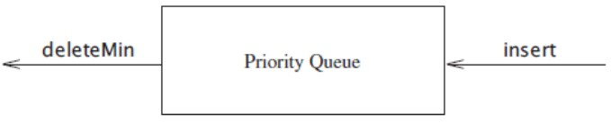
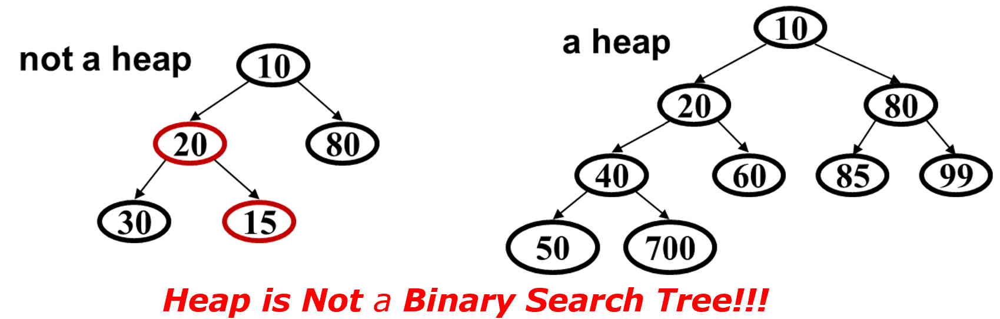
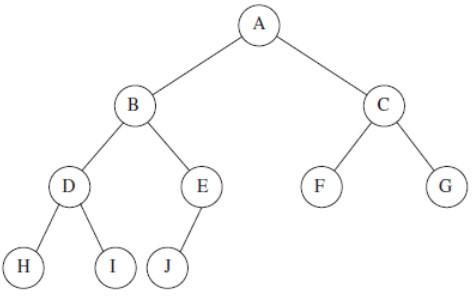
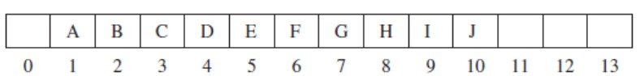
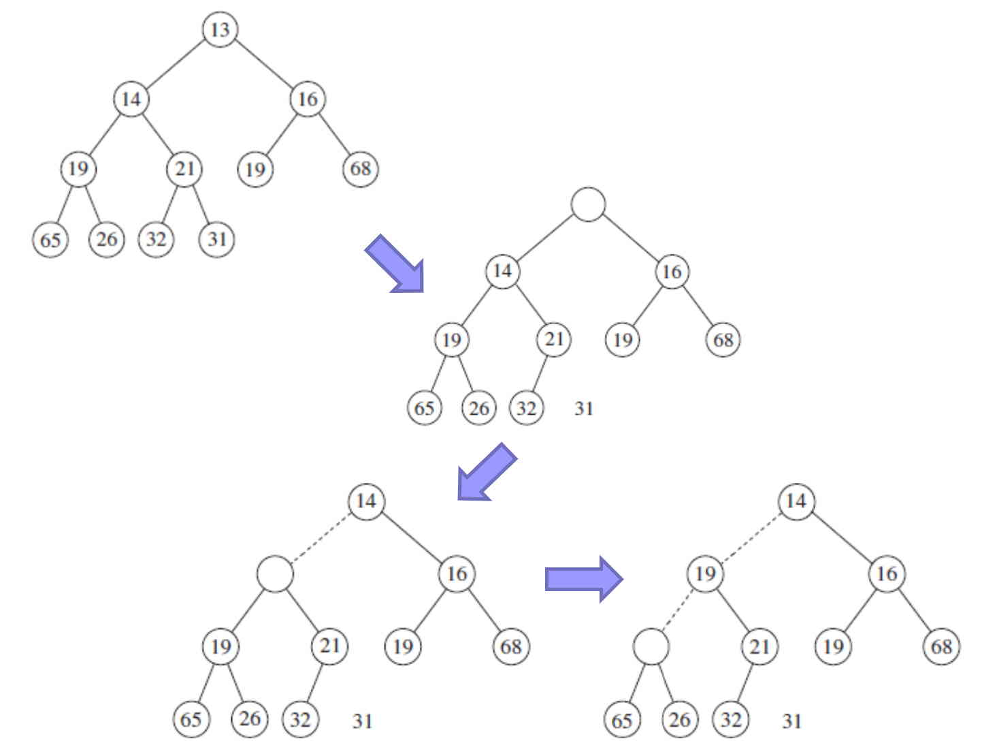
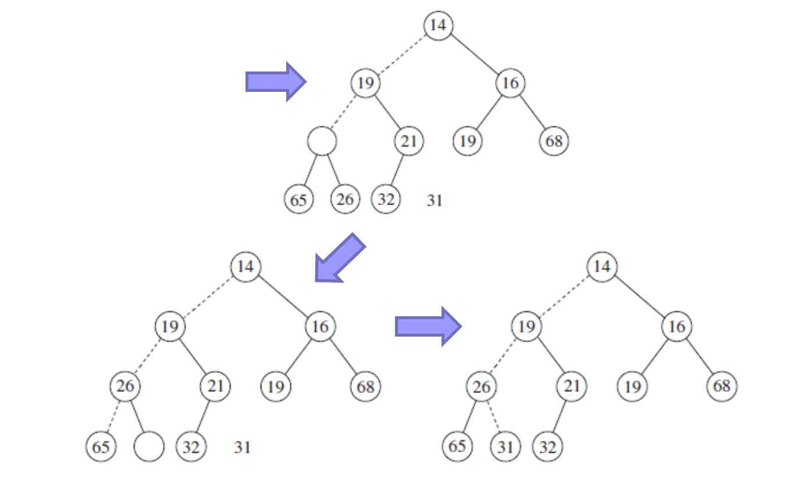
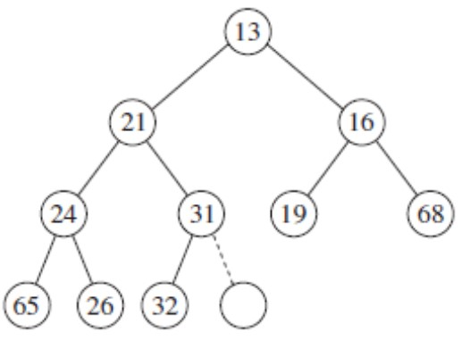
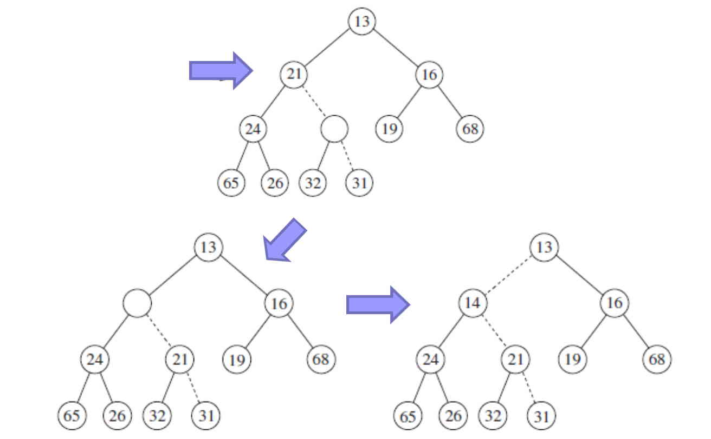
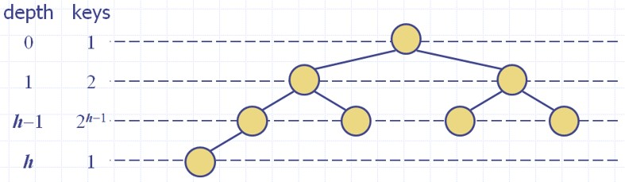

# Priority Queues & Heaps

In computer science, a priority queue is an abstract data-type similar to a regular queue or stack data structure. Each element in a priority queue has an associated priority.

In a priority queue, elements with high priority are served before elements with low priority. In some implementations, if two elements have the same priority, they are served in the same order that they were enqueued in. 

(https://en.wikipedia.org/wiki/Priority_queue)

A priority queue is a data structure (ADT) that allows at least the following two operations: 
* insert/add  
* deleteMin, which finds, returns, and removes the minimum element in the priority queue. 

Note that:
* The insert operation is the equivalent of enqueue, and deleteMin is the priority queue equivalent of the queue’s dequeue operation.



Important points:
* Each item has a “priority”
* An element with high priority is served before an element with low priority. Priority “1” is more important than priority “4”

## Main operations: insert and deleteMin

Example:
```text
	insert x1 with priority 7
	insert x2 with priority 5
	insert x3 with priority 6
	a = deleteMin	// x2
	b = deleteMin	// x3
	insert x4 with priority 4
	insert x5 with priority 8
	c = deleteMin	// x4
	d = deleteMin	// x1
```

## Priority Queues. Simple implementation ideas 

Priority Queues in Simple linked-list
* insertion at the front is O(1)
* deleteMin is O(N) 

Priority Queues in Sorted linked-list 
* insertion  is O(N)
* deleteMin is O(1)

Priority Queues in Binary Search Tree 
* insertion  is (in average) O(logN))
* deleteMin is (in average) O(logN))

Is there another solution?


## Priority Queues as binary heaps

Heap data structure can be used to implement a priority queue. A heap data structure should not be confused with the heap, a pool of memory used for dynamic memory allocation. A common implementation of a heap is the binary heap, which is defined as a binary tree with two additional properties:

Structural property: A binary heap is a complete binary tree, i.e., all levels of the tree, except possibly the last one (deepest) are fully filled, and, if the last level of the tree is not complete, the nodes of that level are filled from left to right.

Heap Property: The key stored in each node is either “greater than or equal to” or “less than or equal to” the keys in the node’s children.

## Properties

A binary min-heap (or binary min heap or max heap) has:

* Structure property: A complete binary tree – binary tree that is completely filled (full tree), with the possible exception of the bottom level, which is filled from left to right. 
* (Min) Heap property: The priority of every (non-root) node is less important than the priority of its parent.
* (Max) Heap property: The priority of every (non-root) node is more important than the priority of its parent.

	


What is the height of a heap with N items?   O(logN)

Important points:
* Heap - a complete binary tree is so regular then it can be represented in an array and no links are necessary. 






* For any element in array position i, the left child is in position 2i, the right child is in the cell after the left child (2i + 1), and the parent is in position i/2. 
* Links are not required and the operations required to traverse the tree are extremely simple

## Priority Queues (heap). Operations 

* findMin: return root.data
* deleteMin. Perlocate down strategy. 
    * answer = root.data (key at the root)
    * Replace the key at the root by the key of the last (right-most) leaf node. 
    * Delete the last leaf node.
    * As long as the heap order property is violated, percolate down.



Percolate down: 
* Keep comparing priority of item with both children.
    * If priority is less important, swap with the most important child and go down one level.
    * Done if both children are less important than the item or we’ve reached a leaf node.




* insert:
    * Put new node in next position on bottom row to restore structure property, (create a hole in the next available location, since otherwise the tree will not be complete).

    * Percolate up to restore heap-order property


Example: insert(14)



Percolate up:
* Put new data in new location. 
* If parent is less important, swap with parent, and continue.
* Done if parent is more important than item or reached root.




# Running time



Running time of deleteMin is O(logN)

For insertimin, the worst-case time proportional to tree height: O(logN).

But… On average, the percolation terminates early; it has been shown that 2.607 comparisons are required on average to perform an insert. So insert is, on average, O(1).

## Samples


See Java code for (binary) Heap in:

http://users.cis.fiu.edu/~weiss/cop3530_sum08/July16.java

Author: Mark Weiss 


Complementary material

http://algs4.cs.princeton.edu/24pq


## Class Problem

Given a binary tree, check if it is a min-heap or not. In order words, the binary tree must be a complete binary tree where each node has a higher value than its parent’s value.

Option 1) Recursive Solution
The idea is to traverse the tree in a preorder fashion. The value of each encountered node should be less than its left or right child. If that is not the case for every internal node, the binary tree is not a min-heap.

* To check for a complete binary tree, the left and right child’s index for any node is less than the total number of nodes for every node. We can pass the index as a recursion parameter and check for every node that their left and right child’s index is within the correct range.

```java
import java.util.ArrayDeque;
import java.util.Queue;
 
// A class to store a binary tree node
class Node
{
    int data;
    Node left, right;
 
    Node(int data) {
        this.data = data;
    }
}
 
class Main
{
    // Function to find the total number of nodes in the binary tree
    private static int size(Node root)
    {
        if (root == null) {
            return 0;
        }
        return 1 + size(root.left) + size(root.right);
    }
 
    // Function to check if a given binary tree is a complete binary tree
    // and each node has a higher value than its parent
    private static boolean isHeap(Node root, int i, int n)
    {
       //todo
    }
 
    // Function to check if a given binary tree is a min-heap or not
    public static boolean isHeap(Node root)
    {
        int i = 0;
        return isHeap(root, i, size(root));
    }
 
    public static void main(String[] args)
    {
        /* Construct the following tree
                   2
                 /   \
                /     \
               3       4
              / \     / \
             /   \   /   \
            5     6 8    10
        */
 
        Node root = new Node(2);
        root.left = new Node(3);
        root.right = new Node(4);
        root.left.left = new Node(5);
        root.left.right = new Node(6);
        root.right.left = new Node(8);
        root.right.right = new Node(10);
 
        if (isHeap(root)) {
            System.out.print("The given binary tree is a min-heap");
        }
        else {
            System.out.print("The given binary tree is not a min-heap");
        }
    }
}
```


Option 2) Iterative Solution
The idea is to perform level order traversal for the given binary tree to check both structural and heap properties of a min-heap.

* To check for the structural property, simply check that no non-empty child is encountered for any node once an empty child is seen.

* To check for the heap property, check that both left and right children are greater than the parent node. This can be easily done while inserting the children into the queue.

```java
import java.util.ArrayDeque;
import java.util.Queue;
 
// A class to store a binary tree node
class Node
{
    int data;
    Node left, right;
 
    Node(int data)
    {
        this.data = data;
        this.left = this.right = null;
    }
}
 
class Main
{
    // Function to check if a given binary tree is a min-heap or not
    public static boolean isHeap(Node root)
    {
        // todo

        // we reach here only when the given binary tree is a min-heap
        return true;
    }
 
    public static void main(String[] args)
    {
        /* Construct the following tree
                   2
                 /   \
                /     \
               3       4
              / \     / \
             /   \   /   \
            5     6 8    10
        */
 
        Node root = new Node(2);
        root.left = new Node(3);
        root.right = new Node(4);
        root.left.left = new Node(5);
        root.left.right = new Node(6);
        root.right.left = new Node(8);
        root.right.right = new Node(10);
 
        if (isHeap(root)) {
            System.out.print("The given binary tree is a min-heap");
        }
        else {
            System.out.print("The given binary tree is not a min-heap");
        }
    }
}
```
